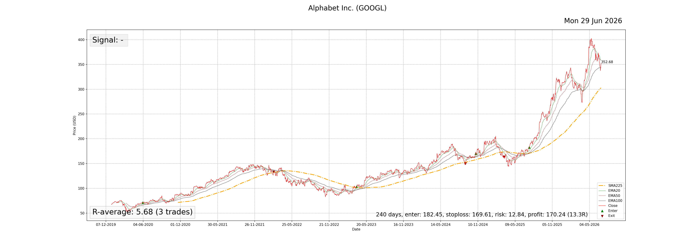
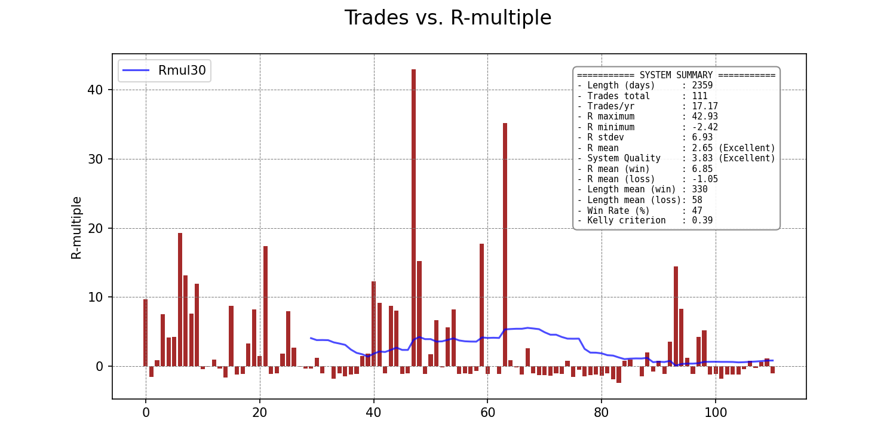
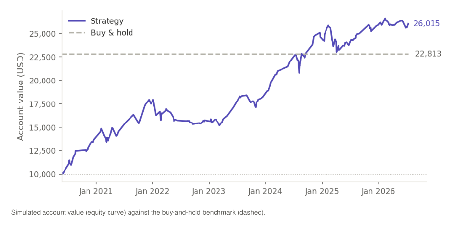
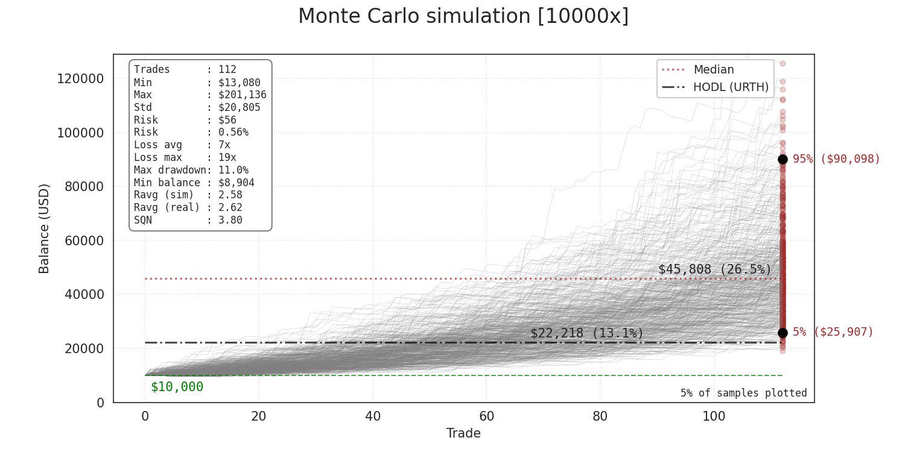
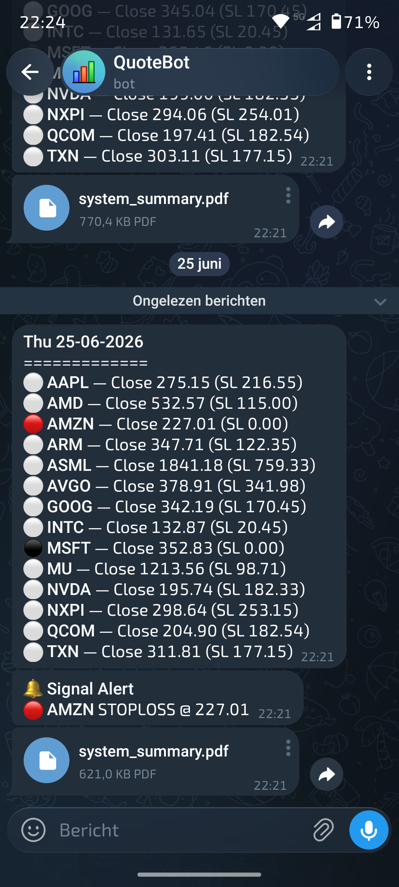

# TradeSysX

TradeSysX (**T**rading **S**ystem e**X**plorer) is a toolkit for backtesting mechanical trading systems. It downloads historical OHLC (Open-High-Low-Close) data
from [Yahoo Finance](https://finance.yahoo.com/), applies a configurable entry/exit/stoploss strategy,
simulates a virtual trading account (paper-trading backtest) using a configurable positon sizing strategy, and runs a Monte Carlo simulation over the obtained R-multiple distribution.

TradeSysX was inspired by the various [books](https://vantharp.com/vans-books/) on trading systems
development written by [Dr. Van K. Tharp](https://vantharp.com/).

## Contents

- [1. Processing steps](#1-processing-steps)
- [2. Configuration](#2-configuration)
  - [2.1 Plot indicators](#21-plot-indicators)
- [3. Environment setup and `tradesysx` cmdline parameters](#3-environment-setup-and-tradesysx-cmdline-parameters)
  - [3.1 Running from a Python virtual environment](#31-running-from-a-python-virtual-environment)
  - [3.2 Running from a Docker container](#32-running-from-a-docker-container)
  - [3.3 Running from a single executable](#33-running-from-a-single-executable)
- [4. Data output](#4-data-output)
  - [4.1 Example plots and graphs](#41-example-plots-and-graphs)

## 1. Processing steps

Running `tradesysx` performs the following processing pipeline for every ticker in the
configured quotes file:

1. **Download ticker data** — fetch OHLC price history from [Yahoo Finance](https://finance.yahoo.com/)
    and store it as `<outdir>/data/<TICKER>_ohlc_raw.csv`.
3. **Add technical indicators** — compute a set of technical-analysis (TA) indicators (e.g. RSI, ATR, SMA/EMA
   moving averages, Bollinger Bands) over the data.
4. **Generate ENTER/EXIT signals** — apply the configured entry strategy
   (`3EMA`, `SMA` or `BBRSI`), exit strategy (`CE`, `CEE`, `RSI`, `XR`,
   `3EMA`, `SMA` or `BBRSI`) and stoploss method (`3atr` or `percent`) to
   produce entry or exit trading signals.
5. **Generate ticker plots** — save a price/indicator plot per ticker
   (`<outdir>/plots/`), optionally with a separate technical-analysis panel
   (`<outdir>/plots/TA/`).
6. **Build the trades table** — collect every completed and open trade into a combined
   trades table and trades list. From this step the R-multiple distribution resulting from
   the trading system is obtained.
8. **Compute the trading system statistics** — System Quality Number (SQN), win rate,
   Kelly criterion, average R per win/loss, trades/year, etc.
9. **Run a balance simulation** — starting with an initial trading account balance, run a
    paper-trade (backtest) using the enter/exit signals generated (step 3), and a configured position sizing strategy
   (`core_equity_risk`, `fixed_dollar_risk`, `fixed_ratio`, `fixed_amount` or `kelly`) to track
   the balance and the total value of the trading account over time.
11. **Run a Monte Carlo simulation** — draw series of trade histories by resampling from the R-multiple distribution obtained
   from the trades (step 5) to estimate the range of possible outcomes (empirical resampling with replacement),
   drawdown and loss streaks, and optionally compare against a configurable buy-and-hold benchmark
   (default: *iShares MSCI World ETF - URTH*).
13. **Generate reports** — save all plots, tables (CSV/PDF) and a combined
   `<outdir>/system_summary.pdf` report covering configuration, statistics and
   key charts.
14. **Notify via Telegram** *(optional)* — publish the daily ENTER/EXIT/stoploss
    signals and the summary PDF to a configured Telegram bot.

## 2. Configuration

The behaviour of `tradesysx` is controlled via JSON config files in `config/`:

- `config/system_conf.json` — main configuration: data range, indicator
  settings, strategy selection (enter/exit/stoploss), position sizing,
  account balance, risk per trade, Monte Carlo parameters and the
  `ta_custom` panel list used by `gen_ta_custom`.
- `config/telegram_conf.json` — bot token and chat ID, only required when
  `notify` is `true`.
- `quotes/quotes_sp500.lst`, `quotes/quotes_nasdaq.lst`, `quotes/quotes_dow30.lst` — example lists of tickers to process.

### 2.1 Plot indicators

The price chart (`<outdir>/plots/<TICKER>_plot.png`) and the price panel of
the TA chart (`<outdir>/plots/TA/<TICKER>_plot_ta.png`) always show the same
overlays, picked from three tiers:

- **Fixed** — the close price, ENTER/EXIT markers and trade annotations are
  always shown;
- **Strategy** — an indicator set is shown automatically when it
  matches the configured `enter` strategy: EMA20/50/100 for `3EMA`, the
  fast/slow SMA pair for `SMA`, Bollinger Bands for `BBRSI`. For the Chandelier
  Exit level, the levels are shown, based on the `exit` strategy (`CE` or `CEE`).
- **User-selectable** — the `plot_indicators` list in `system_conf.json` adds
  indicators that aren't tied to a strategy, currently `"BB"` (Bollinger
  Bands) and `"SMA225"` (225-day SMA, bull/bear market reference).

## 3. Environment setup and `tradesysx` cmdline parameters

Three ways of running `tradesysx` are described, from a [Python virtual environment](#31-running-from-a-python-virtual-environment), from a [Docker container](#32-running-from-a-docker-container), and from a [single executable](#33-running-from-a-single-executable).

### 3.1 Running from a Python virtual environment 

Create a Python virtual environment and *activate* it:

```
python3 -m venv venv
source venv/bin/activate
```
Cd into the directory where `tradesysx` has been cloned or extracted:

1. Install Python dependencies:

   ```sh
   pip install -r requirements.txt
   ```

   Note: `TA-Lib` requires the underlying [TA-Lib C library](https://ta-lib.org/)
   to be installed separately before the Python bindings can be built.
3. Adjust `config/system_conf.json` (and `quotes/quotes_sp500.lst`) to
   match your desired tickers, strategy and account settings.
4. (Optional) Fill in `config/telegram_conf.json` and set `"notify": true` to
   receive daily updates on Telegram.
5. Run the pipeline:

   ```sh
   python tradesysx.py [--basedir <path>] [--config <file>] [--outdir <path>] [--loglevel <level>]
   ```

   **Options:**

   `--basedir` defaults to the current working directory and is used to
   locate the `config/` and `quotes/` directories.

   `--config` selects the system configuration file. Relative paths are
   resolved against `basedir`; absolute paths are used as-is. Defaults to
   `config/system_conf.json`.

   `--outdir` sets the output directory where all generated data, plots,
   tables and reports are written to. Relative paths are resolved against
   `basedir`; absolute paths are used as-is. Defaults to `out/`.

   `--loglevel` controls console verbosity [`DEBUG`, `INFO` (default),
   `WARNING`, `ERROR` or `CRITICAL`]

### 3.2 Running from a Docker container

An alternative way to run `tradesysx` is from a Docker container. The steps involved are described in more detail [here](scripts/README.md#running-tradesysx-from-a-docker-container).

### 3.3 Running from a single executable

To bypass the need for the creation of a Python virtual environment a third way to run `tradesysx` is from a single executable. The steps involved can be found [here](scripts/README.md#running-tradesysx-from-a-single-executable).
   
## 4. Data output

All data output is written to the output directory. The following data, plots and images are generated:

- `<outdir>/data/` — raw and processed OHLC data per ticker
- `<outdir>/plots/` — per-ticker price charts
- `<outdir>/plots/TA/` — next to price, includes indicator panels
- `<outdir>/plots/TA-custom/` — generates custom TA plots (`gen_ta_custom=true`)
- `<outdir>/images/` — system-level plots (trades distribution, balance, Monte Carlo)
- `<outdir>/tables/` — trades table and trades list as CSV files
- `<outdir>/system_summary.pdf`, `full_system_summary.pdf` (`report_type=full`), `trades_table.pdf` and `trades_list.pdf` — combined PDF reports

### 4.1 Example plots and graphs

Shown below are some typical plots generated after running `tradesysx`.

#### Price plot (3EMA strategy)

The plot below shows the price chart of Google (Alphabet Inc.). For the triple moving average (3EMA) strategy,
the plot is overlayed with 3 colored moving average lines. The resulting ENTER and EXIT trading signals are also shown on
the plot (green and red triangles). Displayed in the bottom part are the current R-average and trade statistics.



#### R-multiple distribution

When applied to the downloaded data, the combination of a specific ticker set, timerange and trading strategy incl. the parameters, results in 
a set of trading outcomes that can be expressed as a multiple of the initial risk taken (R-multiple) per trade, where the initial risk per unit is called 1R.
This set of trading outcomes can be shown as in the figure below, which shows all individual trade results from left to right expressed as R-multiples.
Also shown in the top right corner of the figure is a summary of the system statistics, which are calculated from the set of trading outcomes. Two notable system
statistics characterizing the trading system include the average R-multiple (R-mean) and the System Quality Number (SQN).



#### Trading backtest

One of the steps in the pipeline performs a backtest on the downloaded data. This step basically answers the question: *"What would have happened to the balance in the trading account if the trading system had been applied from start to finish using a selected position sizing strategy?"*

The plot below shows the balance (dotted brown line) and the total value (solid green line) of the trading account from the data start date to the end date. The red and green triangles shown in the bottom show the trade entry end exit signals. The size of each individual trade position is determined by the position sizing strategy (here the total risk taken per trade is a percentage of the balance at the enter date).

The trading account end balance is also (optionally) compared against a configurable benchmark which, is show as "Buy-and-Hold" (HODL). The HODL value shown in the bottom right corner of the plot is the total value of the benchmark stock at the end date, given that 100% of the account balance was used to buy the benchmark stock at the start date, with no active trading in between. 



#### Monte Carlo simulation

After obtaining the R-multiple distribution, a Monte Carlo simulation can be used to explore a range of *possible* alternative trade sequences. However, the results from the simulation should be interpreted with caution as the simulation is inherently an approximation, and small changes in the underlying R-multiple distribution will significantly affect the outcome. The simulation attempts to visualize the range of possible alternate outcomes given the R-multiple distribution by drawing (*resampling*) with replacement from the distribution. By randomly drawing individual trade outcomes from the set, many different series of trade histories emerge while adhering to the probability distribution of the set. If a sufficient number of samples are drawn, the sampled average R-multiple will converge to the average R-multiple of the set.

For each simulated trade series, the simulation samples a series with the length of the number of trades or less if `sim_len_max` is smaller and repeats this process N times (set by the `iterations` parameter). Furthermore, it is assumed that at each trade a 1R risk equal to the average risk percentage calculated from the backtest is taken. The average risk is taken here in an attempt to simulate simultaneous trades, as will happen during real trading, in contrast to running the simulation as a series of sequential trades (where the full balance will be available for each trade).

In the picture below, an Monte Carlo simulation with 10 000 iterations was run. Starting with the configured starting balance in the trading account, only 5% of all resampled sequences have been plotted (for clarity, configurable with the `plot_frac` parameter). However, the numbers in the figure represent the values obtained for the full set. On the right-hand side of the figure, the median values of the outcomes (dotted line) as well as the 95 and 5 percentile markers are shown. If configured, the line for the benchmark value (HODL) is also shown. The percentile values between the round brackets show the CAGR (annualized growth rate) of the starting capital. The text box in the upper left corner shows some more computed values, of which the average loss streak, the maximum loss streak, and the maximum drawdown percentage might be of interest. To accommodate for a very skewed outcome distribution, the y-axis is cut off from a value above 4 times the standard deviation from the median, which is set by the `outlier` parameter.



#### Telegram notification (*Optional*)

After running the pipeline, a notification can be sent to a Telegram bot. This option is configured by setting `notify=true` in the `config/system_conf.json` file. The current notification includes the close price of all tickers, as well as the stoploss price and the current signal (currently **IN** a trade ⚪, currently **NOT IN** a trade ⚫, **ENTER** 🟢, **EXIT** 🔵, or **STOPLOSS** 🔴). The update also sends a system summary report in PDF format. An example of this is shown in the screenshot below.

<p align="center">
  
</p>
